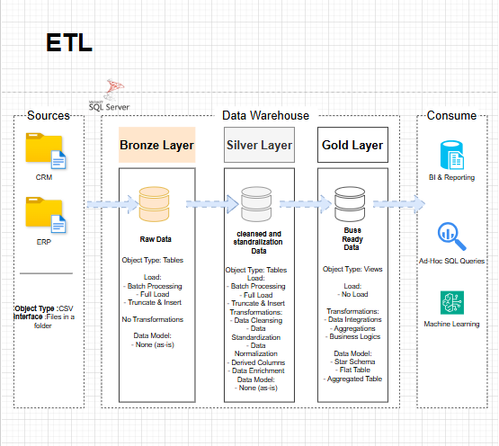

# Data Warehouse and Analytics Project

Welcome to the **Data Warehouse and Analytics Project** repository! 🚀  
This project demonstrates a comprehensive data warehousing and analytics solution, from building a data warehouse to generating actionable insights. Designed as a portfolio project, it highlights industry best practices in data engineering and analytics.

---

## 👤 About the Project Owner

Hi! I'm a **motivated and passionate aspiring Data Engineer** focused on building modern data solutions and transforming raw data into meaningful insights.  

This project represents my hands-on experience in:
- SQL Development  
- Data Warehousing  
- ETL Pipelines  
- Data Modeling  
- Data Analytics  

🙏 This project was built with guidance and inspiration from the amazing **Baraa (Data With Baraa)**, whose content helped me understand real-world data engineering concepts and apply them عمليًا.

---

## 🏗️ Data Architecture

The data architecture for this project follows Medallion Architecture **Bronze**, **Silver**, and **Gold** layers:

1. **Bronze Layer**: Stores raw data as-is from the source systems. Data is ingested from CSV files into SQL Server.
2. **Silver Layer**: Includes data cleansing, standardization, and transformation processes.
3. **Gold Layer**: Contains business-ready data modeled into a star schema for reporting and analytics.

---

## 📖 Project Overview

This project involves:

1. **Data Architecture**: Designing a modern data warehouse using Medallion Architecture.
2. **ETL Pipelines**: Extracting, transforming, and loading data from ERP & CRM sources.
3. **Data Modeling**: Creating fact and dimension tables optimized for analytics.
4. **Analytics & Reporting**: Developing SQL-based insights for decision-making.

🎯 This project showcases skills in:
- SQL Development  
- Data Engineering  
- ETL Pipelines  
- Data Modeling  
- Data Analytics  

---

## 🛠️ Tools & Resources

Everything used in this project is free:

- SQL Server Express  
- SQL Server Management Studio (SSMS)  
- Draw.io (for architecture & diagrams)  
- GitHub (version control)  
- Notion (project planning)  

---

## 🚀 Project Requirements

### Objective
Build a modern data warehouse using SQL Server to support analytical reporting and decision-making.

### Specifications
- Import data from ERP and CRM systems (CSV files)
- Clean and handle data quality issues
- Integrate data into a unified model
- Focus on current data (no historization)
- Provide clear documentation

---

## 📊 BI: Analytics & Reporting

### Objective
Develop SQL-based insights into:

- Customer Behavior  
- Product Performance  
- Sales Trends  

These insights support better business decisions.

---

## 📂 Repository Structure
